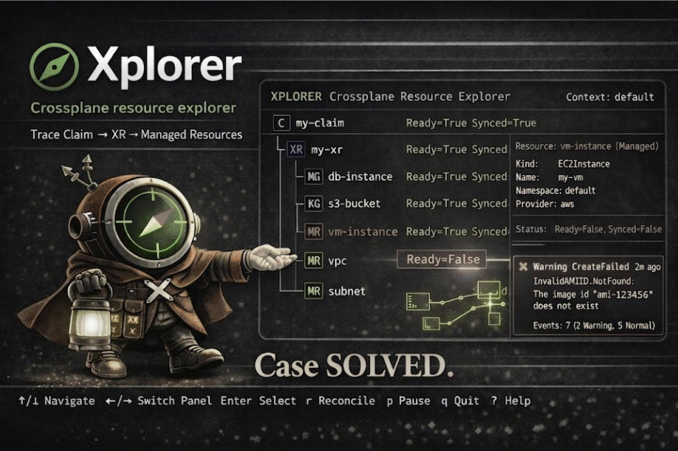

# Xplorer

**Crossplane resource explorer** - Trace claims through composite resources (XRs) to managed resources.

<p align="center">
  
</p>

## Why Xplorer?

When working with Crossplane, understanding resource relationships and debugging issues is challenging. With `kubectl` you can inspect individual resources, but tracing through the hierarchy requires many commands:

```bash
kubectl get claims -A
kubectl get composite
kubectl get managed
kubectl describe <claim>
kubectl describe <xr>
kubectl describe <managed-resource>
kubectl get events --field-selector involvedObject.name=<resource>
# ...and manually correlating all of this
```

**Xplorer solves this by:**

- Automatically discovering the complete resource hierarchy from a claim
- Showing health status propagation through the tree
- Highlighting problematic resources with error details and events
- Providing a single command to understand what's happening

What would take multiple `kubectl` commands and manual piecing together becomes:

```bash
xplorer show my-claim -v
```

## Installation

### macOS / Linux (Homebrew)

```bash
brew tap xplorerhq/dist
brew install xplorer
```

### Direct Download

Download the latest binary for your platform from [Releases](https://github.com/XplorerHQ/xplorer-community/releases):

| Platform | Asset |
|----------|-------|
| macOS (Apple Silicon) | `xplorer-<version>-darwin-arm64.tar.gz` |
| macOS (Intel) | `xplorer-<version>-darwin-x64.tar.gz` |
| Linux (x64) | `xplorer-<version>-linux-x64.tar.gz` |
| Windows (x64) | `xplorer-<version>-windows-x64.zip` |

Each asset includes a `.sha256` checksum file for verification.

**Linux / macOS:**
```bash
tar -xzf xplorer-<version>-<platform>.tar.gz
sudo mv xplorer/xplorer /usr/local/bin/
```

**Windows:**
Extract the zip and add the `xplorer` directory to your `PATH`.

## Quick Start

### TUI (Interactive Terminal UI)

Launch the full interactive terminal UI to explore your cluster visually:

```bash
xplorer tui
```

The TUI provides:
- Resource tree with health status indicators
- Syntax-highlighted YAML manifests
- Pause/resume resource reconciliation (with cascade support)
- Fuzzy search across resources
- Multiple color themes
- Keyboard-driven navigation

See [Getting Started](docs/getting-started.md) for a walkthrough with screenshots.

### CLI

```bash
# List all Crossplane claims
xplorer list --claims

# Explore a specific claim's hierarchy
xplorer show my-database-claim

# Show full hierarchy with health status
xplorer show my-database-claim -v

# Watch a claim for changes
xplorer watch my-database-claim

# Interactive mode with fuzzy search
xplorer show
```

## Features

- **Interactive TUI** - Full terminal UI with tree navigation, manifest viewer, and resource management
- **Hierarchy Discovery** - Automatically traces Claims → XRs → Managed Resources
- **Health Status** - Shows Ready/Synced status with propagation through the tree
- **Error Details** - Surfaces error messages and related events
- **Pause/Resume** - Toggle reconciliation on resources, with cascade support for entire hierarchies
- **Interactive Selection** - Fuzzy search when no claim specified
- **Watch Mode** - Real-time updates as resources change
- **Smart Caching** - Reduces API server load with intelligent caching

## Documentation

- [Getting Started](docs/getting-started.md)
- [CLI Getting Started](docs/cli-getting-started.md)
- [Keyboard Shortcuts](docs/keyboard-shortcuts.md)
- [CLI Reference](docs/cli-reference.md)
- [FAQ](docs/faq.md)

## Requirements

- Kubernetes cluster with Crossplane installed
- `kubectl` configured with cluster access

## Status

**Alpha** - Actively developed. Feedback welcome. [Report issues](https://github.com/XplorerHQ/xplorer-community/issues).

## Feedback & Support

- [Report a Bug](https://github.com/XplorerHQ/xplorer-community/issues/new?template=bug_report.md)
- [Request a Feature](https://github.com/XplorerHQ/xplorer-community/issues/new?template=feature_request.md)
- [Ask a Question](https://github.com/XplorerHQ/xplorer-community/discussions)

## Sponsor

If Xplorer helps your workflow, consider [sponsoring](https://github.com/sponsors/XplorerHQ) to support development.

---

© 2025 Alex Hubitski. All rights reserved. Free for evaluation.
