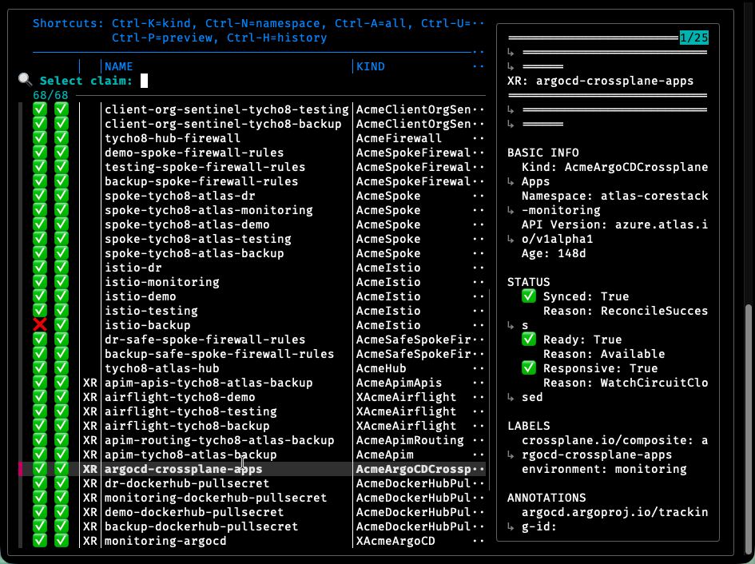

# CLI Getting Started

This guide covers Xplorer's CLI usage. For the interactive TUI, see the [Getting Started](getting-started.md) guide.

## Prerequisites

You need a Kubernetes cluster with Crossplane installed, `kubectl` configured with cluster access, and at least one Crossplane claim in your cluster.

fzf is not required. If you prefer CLI over the full TUI and want an interactive fuzzy selector for browsing claims and XRs, [fzf](https://github.com/junegunn/fzf) greatly improves that experience. Without it, Xplorer falls back to a simpler built-in selector. To install:

```bash
brew install fzf          # macOS
sudo apt install fzf      # Debian / Ubuntu
sudo dnf install fzf      # Fedora
```

## Installation

### Homebrew — macOS / Linux

```bash
brew tap xplorerhq/dist
brew install xplorer
```

### Direct Download

Download the binary for your platform from [Releases](https://github.com/XplorerHQ/xplorer-community/releases):

| Platform | Asset |
|----------|-------|
| macOS (Apple Silicon) | `xplorer-<version>-darwin-arm64.tar.gz` |
| macOS (Intel) | `xplorer-<version>-darwin-x64.tar.gz` |
| Linux (x64) | `xplorer-<version>-linux-x64.tar.gz` |
| Windows (x64) | `xplorer-<version>-windows-x64.zip` |

**Linux / macOS:**
```bash
tar -xzf xplorer-<version>-<platform>.tar.gz
sudo mv xplorer/xplorer /usr/local/bin/
```

**Windows:** Extract the zip and add the `xplorer` directory to your `PATH`.

### Verify Installation

```bash
xplorer --version
```

## List Available Claims

See all Crossplane claims across namespaces with their health status:

```bash
xplorer list --claims
```

## Explore a Claim

Pick a claim and trace its resource hierarchy:

```bash
xplorer show <claim-name>
```

This shows the claim and its immediate composite resource (XR). Add `-v` to expand the full tree down to managed resources, including health status and error details for anything unhealthy:

```bash
xplorer show <claim-name> -v
```

## Interactive Mode

Running `xplorer` with no arguments launches an interactive resource selector powered by [fzf](https://github.com/junegunn/fzf) — fuzzy-search through all claims and XRs, then runs the appropriate command for the selected resource.

```bash
xplorer
```



A lightweight alternative when you want quick CLI output without launching the full TUI. If `fzf` is not installed, Xplorer falls back to a simpler built-in selector. For the best experience, install `fzf` via your package manager (`brew install fzf` on macOS).

## Watch for Changes

Monitor a claim in real time as resources change:

```bash
xplorer watch <claim-name>
```

## Understanding the Output

The CLI output shows a tree from claim down to managed resources:

```
my-database (Claim)
└── my-database-xyz (XR: XDatabase)
    ├── my-database-xyz-abc (RDSInstance) - Ready
    ├── my-database-xyz-def (SecurityGroup) - Ready
    └── my-database-xyz-ghi (SubnetGroup) - Ready: False ← Issue here
```

Each resource carries two status flags. `Ready` indicates the resource is fully operational — `False` means there are issues, check the error details. `Synced` indicates the resource matches desired state — `False` means it's drifted or is still reconciling.

## Next Steps

See [Getting Started](getting-started.md) for the full interactive TUI walkthrough, [Keyboard Shortcuts](keyboard-shortcuts.md) for the shortcut reference, and [CLI Reference](cli-reference.md) for all available commands.
