# Getting Started

Xplorer's Terminal UI (TUI) provides a full interactive experience for exploring and managing Crossplane resources. This guide walks you through the TUI. For CLI usage, see the [CLI Getting Started](cli-getting-started.md) guide.

## Launching the TUI

```bash
xplorer tui
```

Or use the direct alias:

```bash
xplorer-tui
```

## Overview

When the TUI launches, it connects to your Kubernetes cluster, discovers all Crossplane resources, and presents them in a fuzzy-searchable XR and XRC (Claim) list.

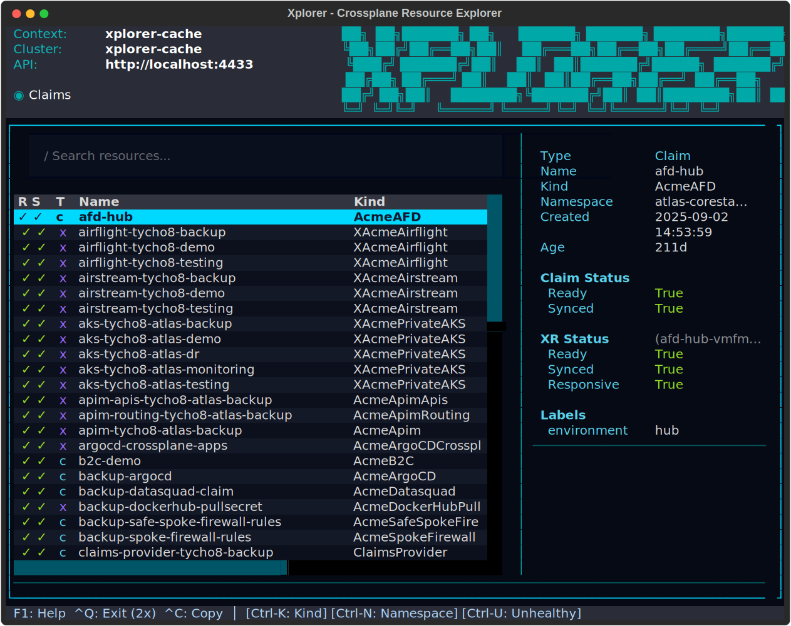

The interface has three main areas:

- **Header** - Cluster connection info (context, cluster, API server) and navigation breadcrumbs
- **Resource List** - All claims and XRs with health status, searchable with fuzzy matching
- **Footer** - Context-sensitive keyboard shortcuts

Press `F2` to hide the header and maximize the resource list area. The breadcrumbs collapse into a single line above the list so you keep navigation context without the overhead.

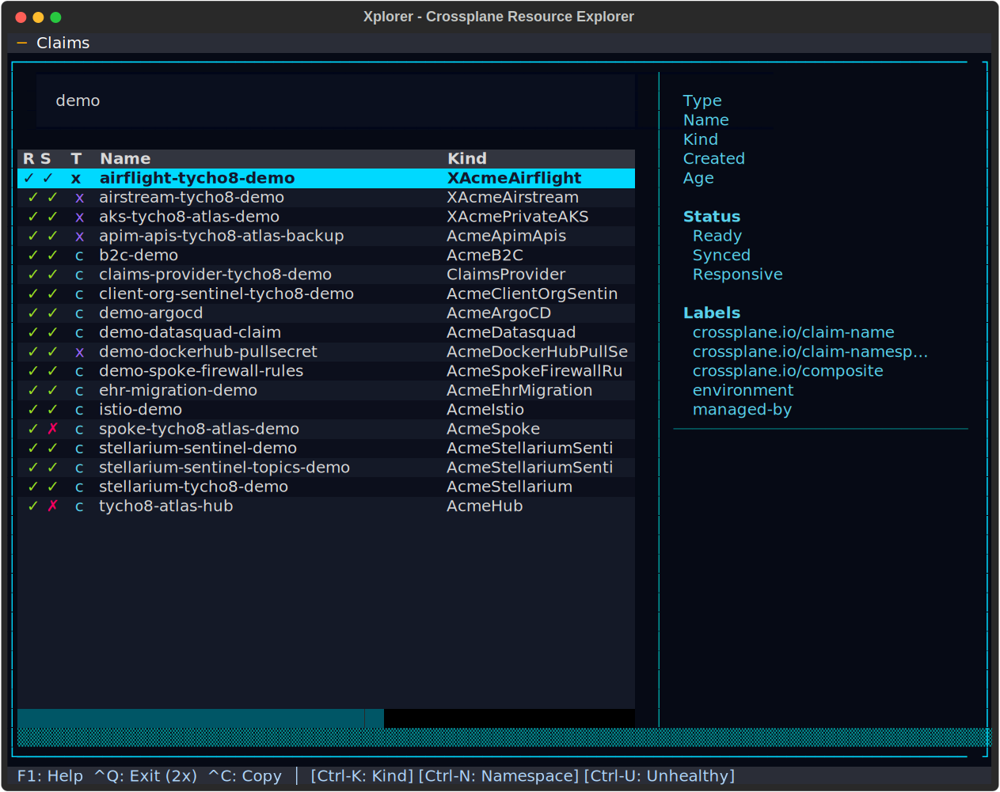

Each row in the resource list shows:

| Column | Meaning |
|--------|---------|
| `R` | Ready status (`✓` = True, blank = False) |
| `S` | Synced status (`✓` = True, blank = False) |
| `T` | Type (`c` = Claim, `x` = XR) |
| `Name` | Resource name |
| `Kind` | Crossplane resource kind |
| `NS` | Namespace (visible on wider terminals) |
| `Age` | Time since resource creation (visible on wider terminals) |

Start typing to filter the list with fuzzy matching. For best results, use more than 3 characters. You can use space-separated terms to narrow down quickly -- each term is matched independently, so `hub backup` will find resources containing both "hub" and "backup" anywhere in their name, kind, or namespace.

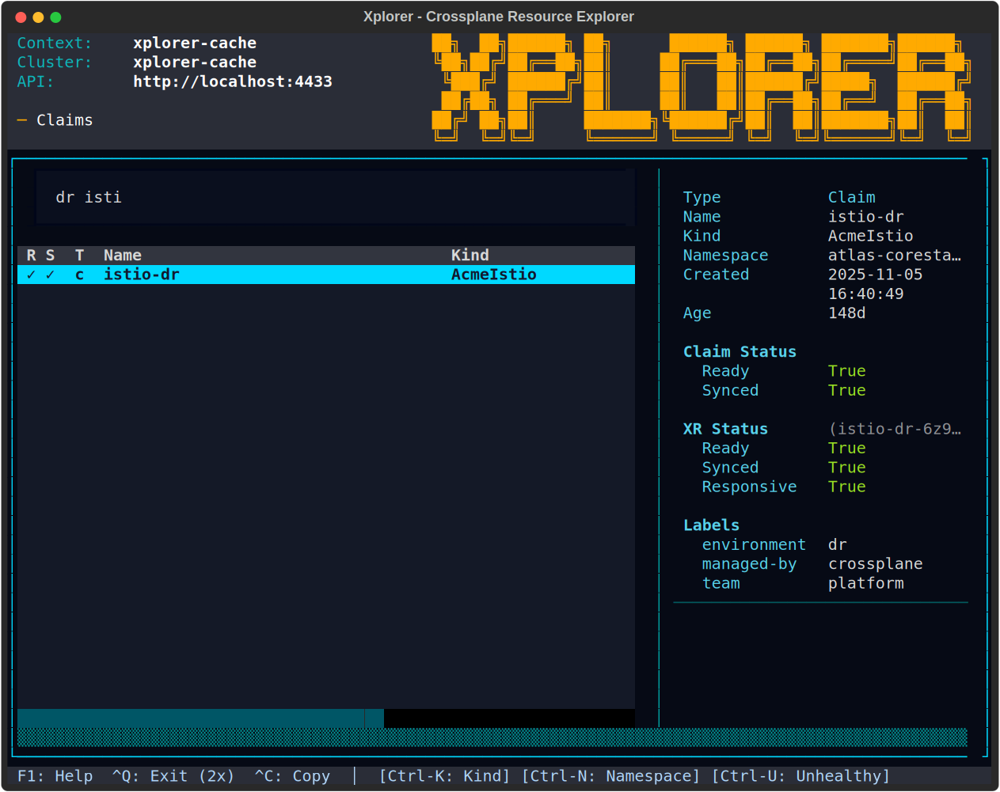

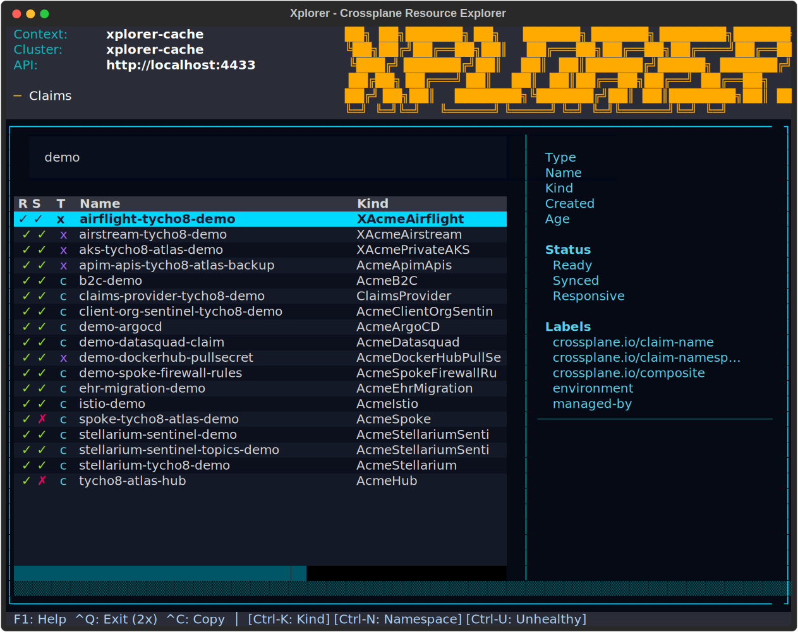

Note that the search currently matches against the full resource manifest, not just the visible columns. This means common labels -- such as those added by ArgoCD or other GitOps tools -- can produce broad matches that select nearly everything. If this affects your workflow, please [report an issue or feature request](https://github.com/XplorerHQ/xplorer-community/issues) to help us refine the matching behavior.

Select any resource and press `Enter` to drill down into its full hierarchy.

## Navigating the Resource Tree

Use arrow keys or `j`/`k` to move through the resource tree. The tree shows the full hierarchy:

```
Claim
 +-- Composite Resource (XR)
      +-- Managed Resource 1
      +-- Managed Resource 2
      +-- ...
```

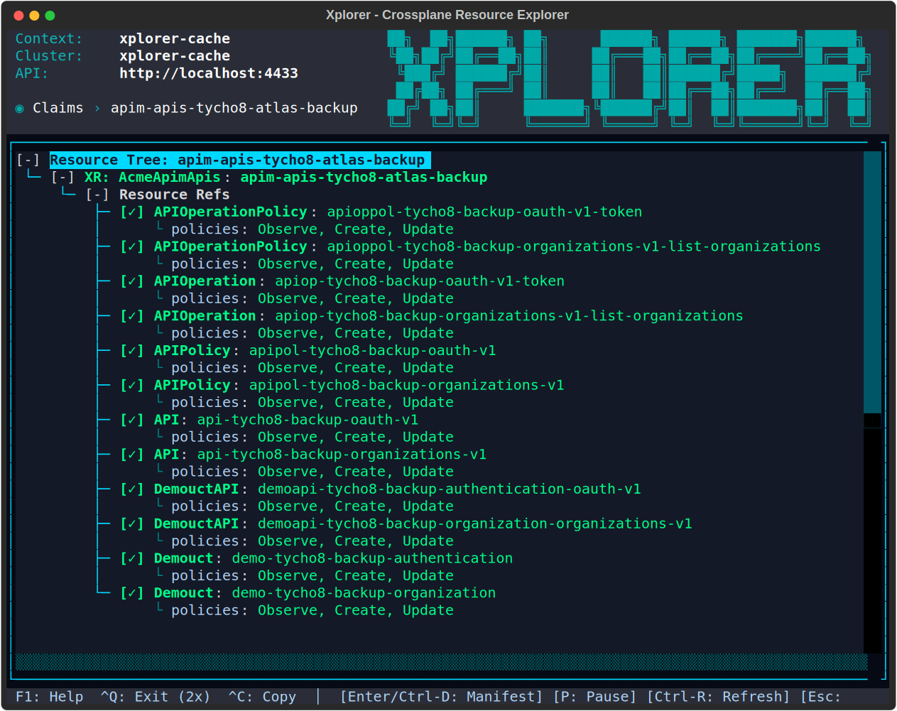

Health status is displayed inline for each resource:
- Healthy resources show Ready/Synced status
- Unhealthy resources are highlighted with error indicators

## Live Updates

The tree subscribes to the Kubernetes API watch stream and updates in real time. When a resource receives an update from the cluster, it is briefly highlighted in the tree so you can see exactly which resources are actively changing.

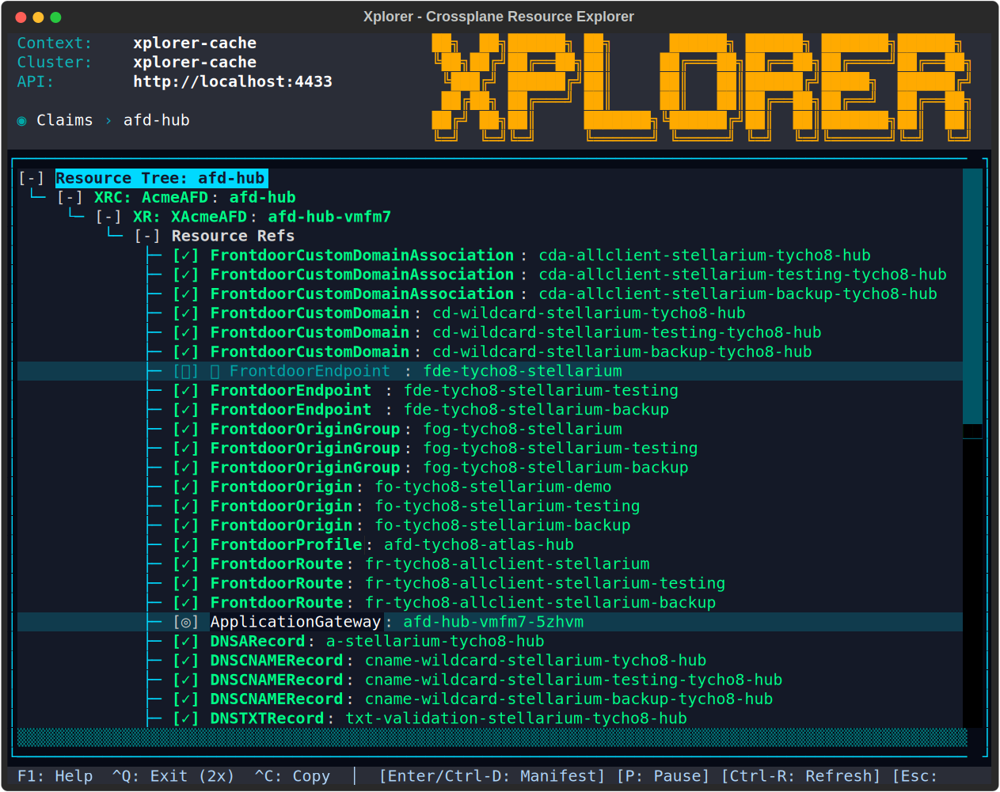

If any of those updates report a status change -- a resource transitioning from healthy to unhealthy, or a new error condition appearing -- the tree automatically switches to the error detail view described in the [debugging section](#debugging-after-a-provider-upgrade) below. You do not need to manually refresh or re-scan; the TUI reacts to cluster state as it happens.

## Viewing Resource Manifests

Press `Enter` or `Ctrl+D` on any resource to open its YAML manifest in a syntax-highlighted panel.

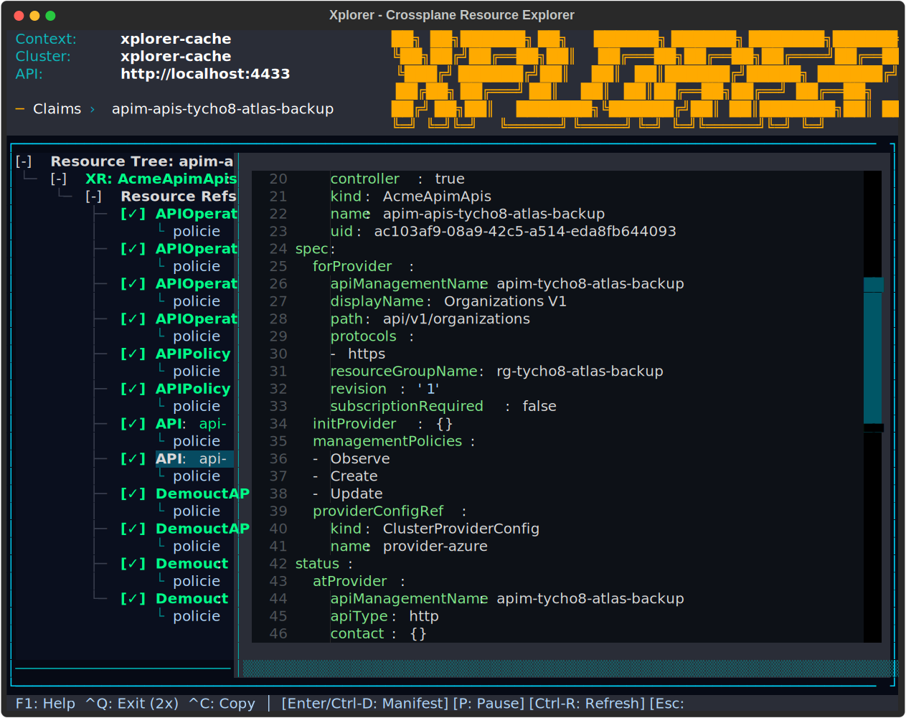

In the manifest panel:
- `Ctrl+T` / `Ctrl+P` - Cycle through syntax themes
- `Ctrl+W` - Toggle word wrap
- `Escape` - Close the manifest panel

## Copying Resource Information

Press `Ctrl+C` on any resource in the tree to copy its details to the clipboard. The copied content includes the resource's status, kind, name, and composition -- ready to paste into a Slack message, incident ticket, or terminal.

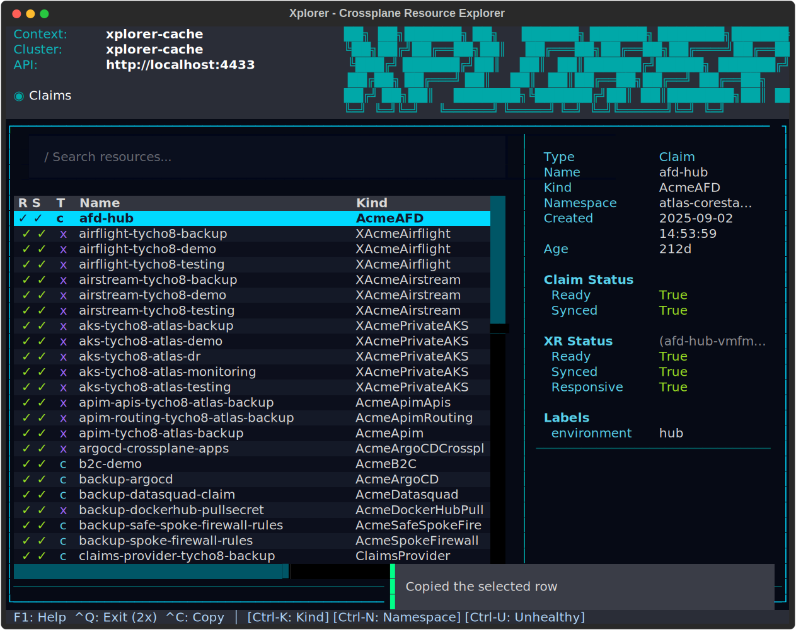

For example, pressing `Ctrl+C` on a selected resource copies a line like:

```
✓ ✓    afd-hub    AcmeAFD    atlas-corestack-hub    212d
```

This gives you the health status, resource name, kind, composition, and age in a single copyable string. For more control, press `Alt+Shift+C` to open an edit panel with the focused content (requires the [iTerm2 Alt key fix](#iterm2-alt-key-configuration)). Inside the panel, use standard cursor keys with `Shift` to select exactly the portion you need, then press `Ctrl+C` to copy the selection and close the panel.

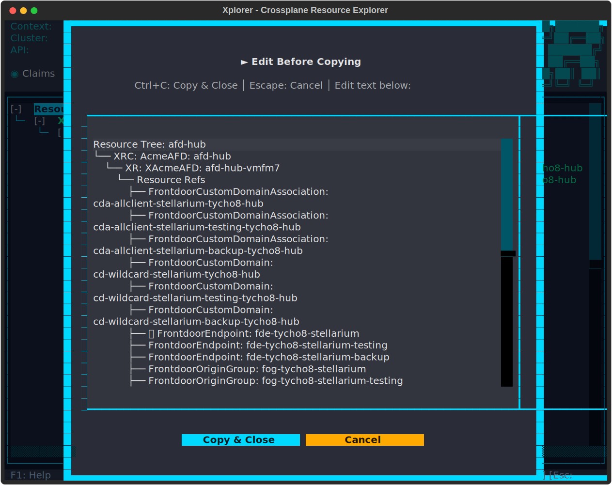

## Debugging After a Provider Upgrade

Provider upgrades can introduce CRD schema changes that break existing compositions. Instead of chasing errors across dozens of `kubectl describe` commands, Xplorer surfaces the root cause directly in the resource tree.

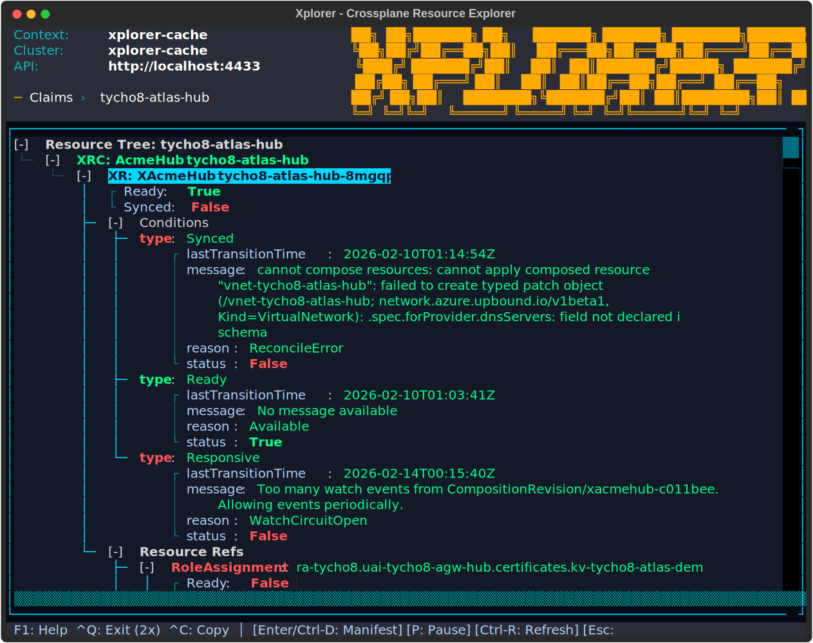

In this example, a provider upgrade changed the CRD schema for `VirtualNetwork`, and the composition still references `.spec.forProvider.dnsServers` -- a field no longer declared in the new schema. Xplorer shows the full error chain at a glance:

- **Synced: False** on the XR with a `ReconcileError` condition
- The exact error message: `field not declared in schema`
- The affected resource and API version (`network.azure.upbound.io/v1beta1, Kind=VirtualNetwork`)
- Downstream effects like `WatchCircuitOpen` from CompositionRevision thrashing

What previously required correlating events across multiple resources is now visible in a single screen. Navigate to the affected resource and press `Enter` to inspect its full manifest.

## Pause and Resume Reconciliation

During incident response or while investigating a failing resource, you often need to prevent Crossplane from continuously reconciling and potentially making things worse. Xplorer lets you pause reconciliation directly from the TUI -- no need to manually patch annotations with `kubectl`.

Navigate to the resource and press `p`. A confirmation dialog shows the resource name, kind, and a clear warning that paused resources will not reconcile:

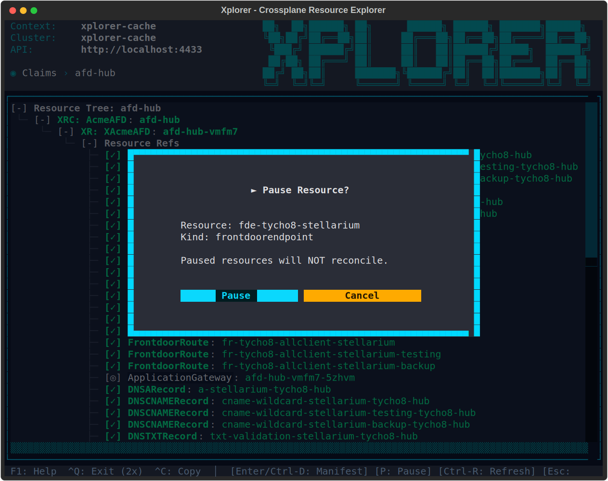

Once confirmed, the resource is immediately paused. The tree reflects the new state with a visual indicator, and the status bar confirms the operation:

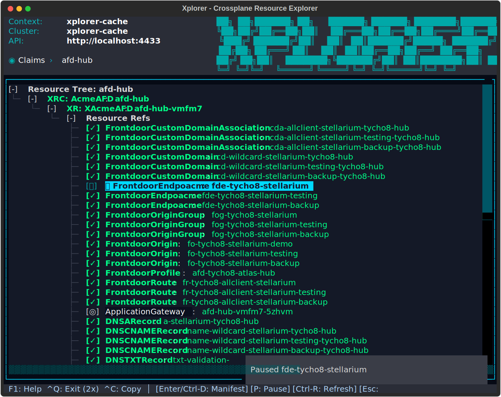

Under the hood, Xplorer adds the `crossplane.io/paused: 'true'` annotation to the resource. You can verify this by opening the manifest -- the annotation is visible directly in the resource's `metadata.annotations`:

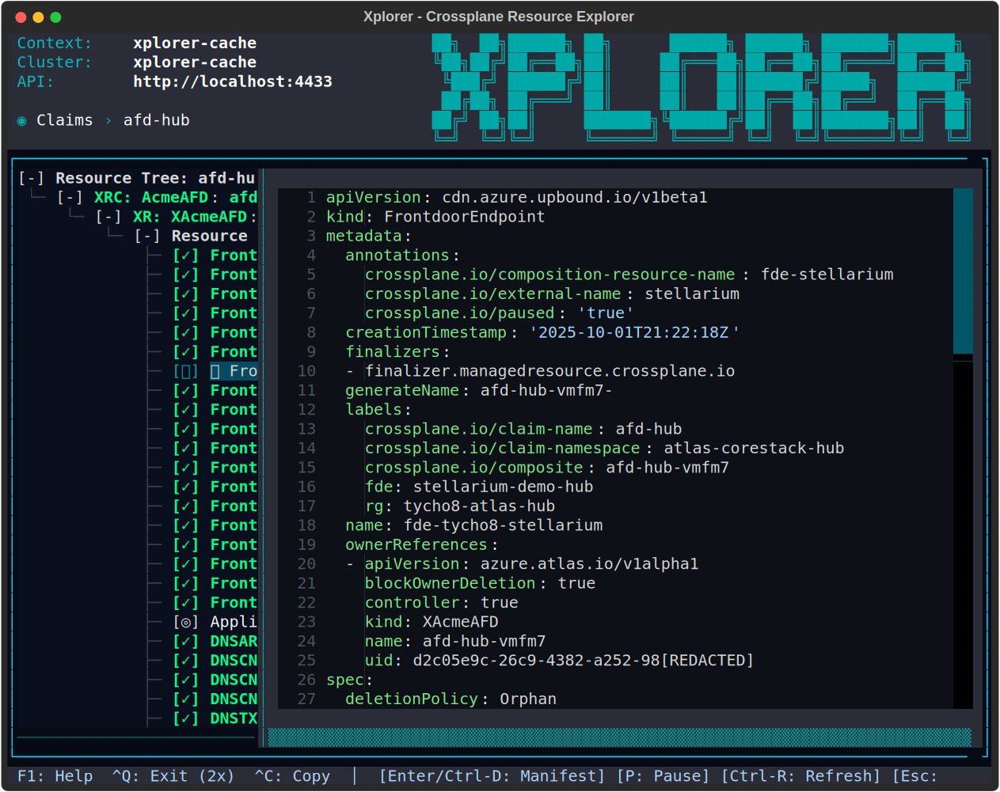

Press `p` again on the same resource to resume reconciliation, which removes the annotation. For broader control, use `Shift+P` to cascade the pause across the selected resource and all of its children -- useful when you need to stabilize an entire claim hierarchy before applying a fix.

## Unhealthy Resources View

Beyond the default tree, the TUI offers alternative views to slice your cluster from different angles.

### Group by Kind

Press `Ctrl+K` to group all resources by their Kubernetes kind. This is useful when you want to see all instances of a particular resource type across your cluster at a glance.

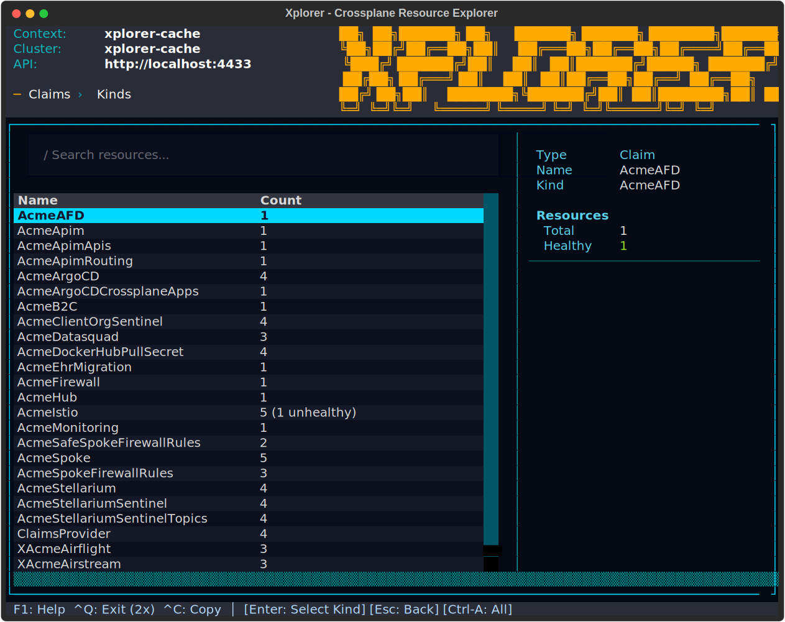

### Group by Namespace

Press `Ctrl+N` to group resources by namespace. In Crossplane v2, namespaces often represent distinct environments (dev, testing, staging, production), so this view effectively gives you a per-environment slice of your cluster state -- letting you quickly assess the health of a specific environment without filtering through unrelated resources.

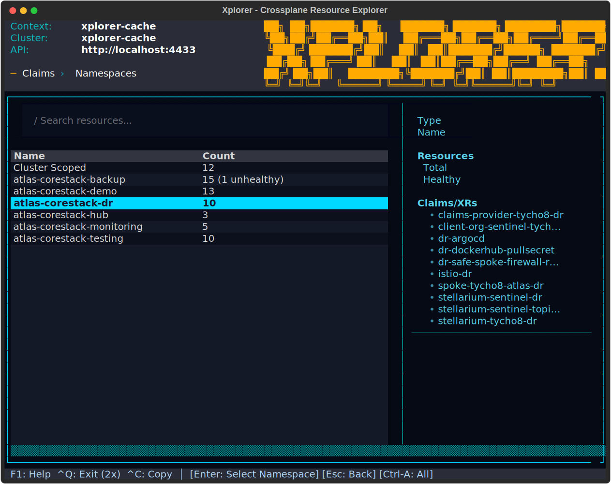

### Unhealthy Scan

Press `Ctrl+U` to trigger an unhealthy scan that surfaces compositions that need attention.

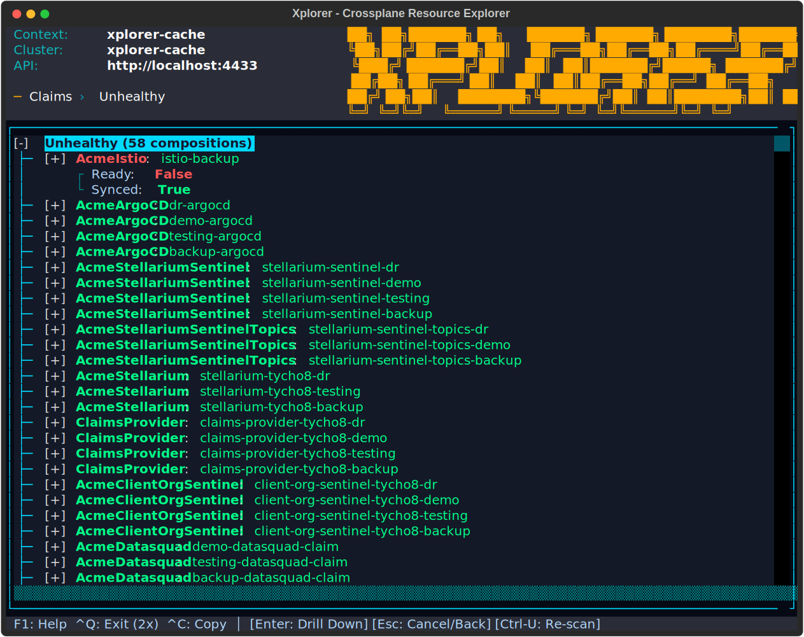

> **Note:** This screenshot uses synthetic test data -- 58 unhealthy compositions at once is not something you would typically encounter in production.

Xplorer detects two distinct categories of unhealthy resources:

1. **Top-level status not True** -- The XR or claim itself reports `Ready: False` or `Synced: False`. These are straightforward to spot even with `kubectl`, but Xplorer aggregates them across the entire cluster in one view.

2. **Healthy parent, unhealthy children** -- The XR or claim reports both `Ready: True` and `Synced: True`, yet one or more underlying managed resources are failing or degraded. This is the harder case to catch. Crossplane's status propagation does not always surface child-level failures to the parent, so without inspecting each managed resource individually, these issues go unnoticed. Xplorer scans the full hierarchy and flags these compositions as unhealthy even when the top-level status looks clean.

Select any composition and press `Enter` to drill down into its full resource tree. The scan traverses every composition in the cluster, so on large clusters with hundreds of compositions it can take a moment -- but the result is a single consolidated view that would otherwise require inspecting each resource individually.

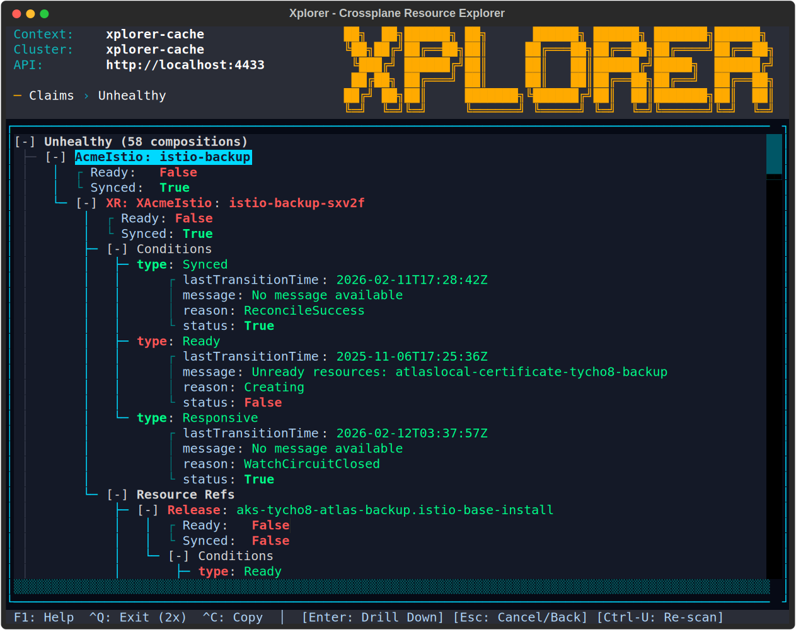

In this expanded view, the XR's Ready condition shows reason `Creating` with the message `Unready resources: atlaslocal-certificate-tycho8-backup` -- a managed resource is still being provisioned by the cloud provider. Drilling further into the Resource Refs reveals the specific `Release` resource with both `Ready: False` and `Synced: False`, along with its own condition details.

No hidden failure goes undetected -- even when a parent XR reports `Ready: True` and `Synced: True`, the scan inspects every managed resource underneath and surfaces any that are degraded, stuck, or still provisioning. This level of visibility across multiple levels of the hierarchy, in a single screen, is what makes the unhealthy scan valuable for day-to-day operations.

## Themes

Xplorer ships with multiple color themes. Switch themes with `Alt+T` (next) and `Alt+Shift+T` (previous).

Available themes:
- xplorer-dark (default)
- textual-dark / textual-light
- nord
- gruvbox
- catppuccin-mocha / catppuccin-latte
- dracula
- tokyo-night
- monokai
- solarized-light
- flexoki

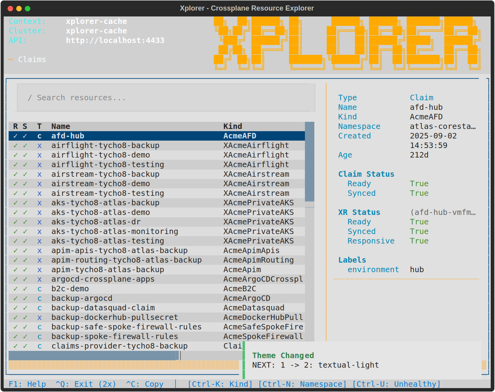

The same shortcut applies to the manifest panel when it is open -- `Alt+T` switches both the main UI theme and the syntax highlighting theme in a single action. Your theme selection is saved to `~/.config/xplorer/config.yaml`, so the TUI restarts with the last used combination.

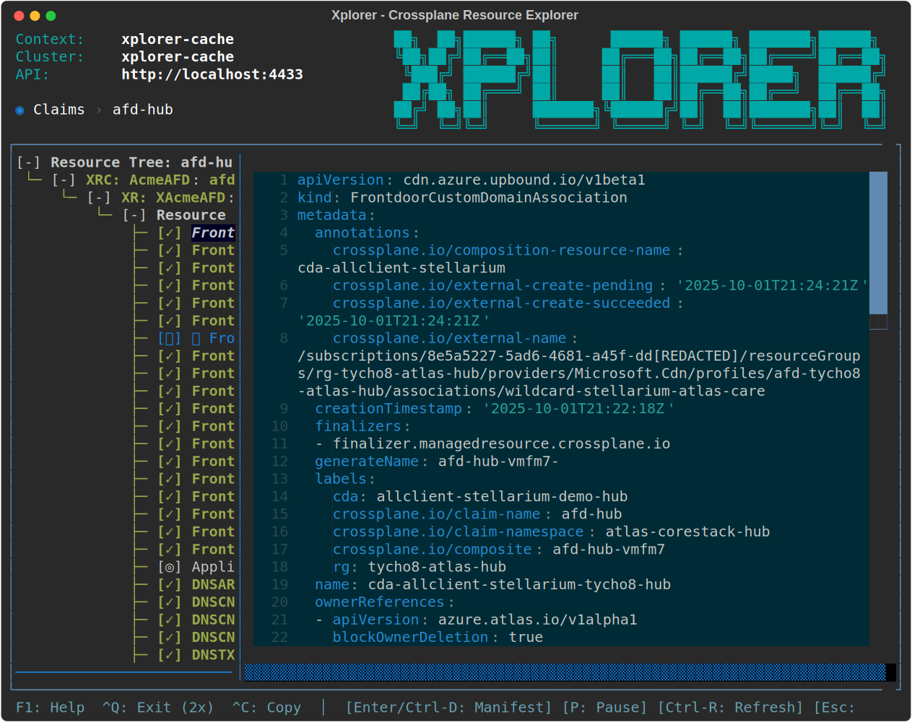

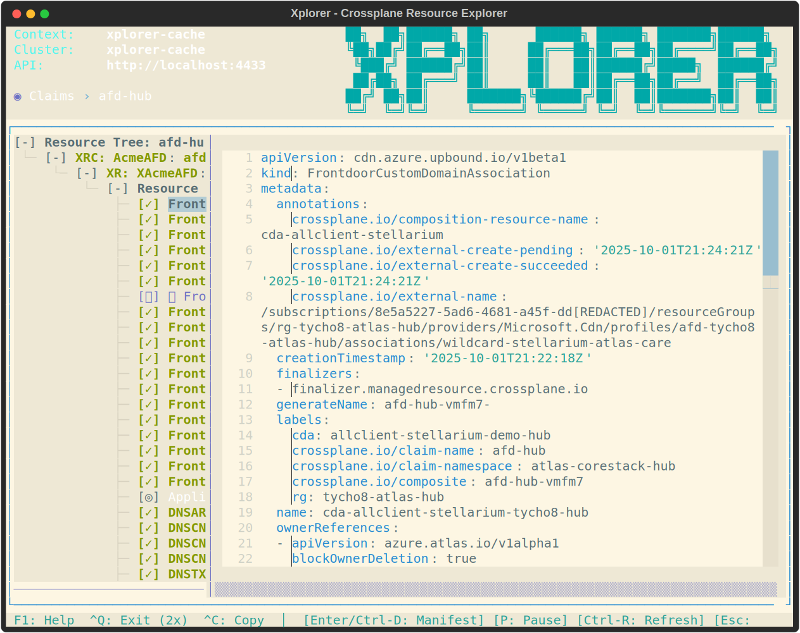

## Help

`F1` is the single most useful key to remember. Press it on any screen to open a contextual help modal that lists every available action for the panel you are currently in. The shortcuts adapt based on context -- the tree panel, manifest panel, and other views each show their own relevant actions.

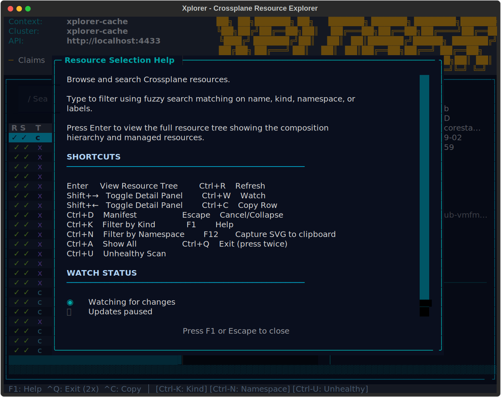

If you forget any of the shortcuts mentioned in this guide, `F1` will always have the answer.

## Universal Resource Palette (WIP)

The Universal Resource Palette lets you query any Kubernetes resource in the cluster -- not just Crossplane resources. Open it with the chord sequence `Ctrl+X, R` and start typing to fuzzy-search across all available resource types.

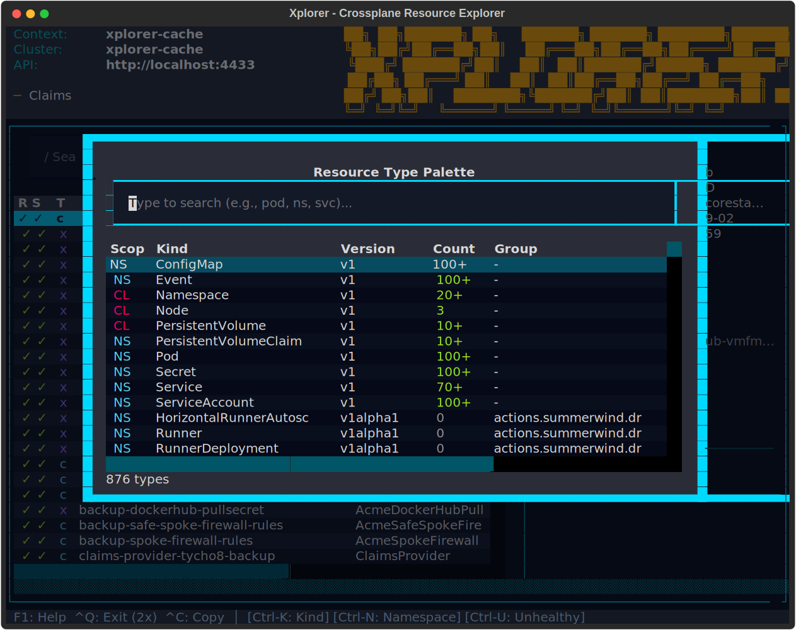

Notably, the palette handles the kind collision problem introduced by Crossplane v2's namespaced managed resources. In v2, providers register the same kind in both the legacy cluster-scoped API group and the new `.m.` namespaced group -- for example, `Bucket` exists in both `s3.aws.upbound.io` and `s3.aws.m.upbound.io`, with identical kind names. This breaks the vast majority of Kubernetes tooling that assumes kind names are unique. The palette presents each variant with its full API group, letting you select the exact resource you need without ambiguity.

This feature is under active development. The goal is to provide a single entry point for browsing any resource in the cluster, with the same manifest viewing and navigation capabilities available for Crossplane resources today.

## Keyboard Reference

See the full [Keyboard Shortcuts](keyboard-shortcuts.md) reference for every shortcut across all panels, including chord shortcuts (`Ctrl+X` prefix sequences).

## iTerm2: Alt Key Configuration

Several TUI shortcuts use the `Alt` modifier (theme switching, copy edit panel). By default, iTerm2 on macOS treats the Option key as a compose key for special characters instead of sending the escape sequence that terminal applications expect.

To fix this, go to **Preferences > Profiles > Keys** and set **Left Option Key** to **Esc+**. This applies to any shortcut using `Alt` in the keyboard reference above.

## Tips

- Use `Ctrl+R` to refresh the tree after making changes outside of Xplorer
- The header auto-hides shortcuts and logo on narrow terminals to preserve space
- Press `F12` to capture an SVG screenshot of the current TUI state to your clipboard
- Use `--context` to connect to a specific Kubernetes cluster: `xplorer tui --context my-cluster`
